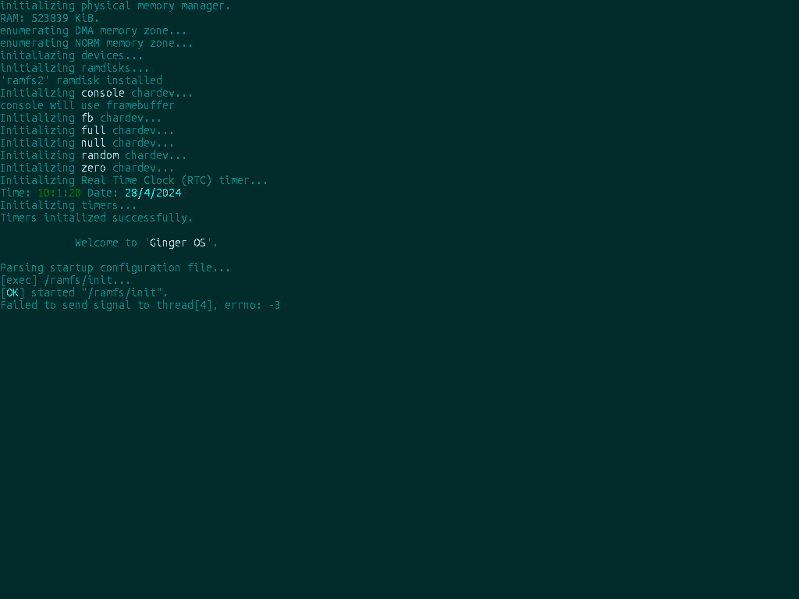

# gingerOs-x86_64

 
 

The Ginger Operating System (Ginger OS) is designed to be a straightforward operating system, aiming for full POSIX compliance and partial Linux compatibility wherever feasible.

Development on Ginger OS commenced in late 2020 as a modest project for educational purposes. However, as the project progressed, my passion for OS development ignited, prompting me to fully commit my time and resources to crafting something unique. By 2022, Ginger OS had yet to reach a functional state, but the wealth of knowledge acquired during its development journey propelled me to achieve a significant milestone: the creation of my first practical Intel x86 OS. This initial iteration featured a rudimentary shell and essential programs, such as sh, cat, echo, grep, wc, pwd, among others (acknowledging the inspiration drawn from UC's xv6 project), all available within the [gingerOS](http://github.com/Emment-Yamikani/gingerOs.git) repository.

## Screenshots

### qemu screenshots

### vbox screenshots

## Supported Architectures

- AMD/Intel
  - x86
  - x86_64
- Riscv (Not supported yet)

Current working on making intel x86_64 arch to work perfectly, then move on to other archs and then later their 32 bit counterparts.

## Features

Please see next section [Road Map](roadmap.md) for more info.

## Road Map

Please read the [Road Map](roadmap.md) to know more about the current and future progress of the Operating System.

## Build requirements
  - GNU's gcc cross compiler specifically version 10.2.1.
  - GNU's make version 4.4.1 or later.
  - Must have mtools, binutils version 2.36.1 or later.
  - Xorriso must have already been installed (needed to build a grub bootable image).
  - Qemu

## How to build

> make

## How to run with Qemu

> make run

# Resources

  [OsDev wiki](https://wiki.osdev.org).

  [Guilds](https://tldp.org/guides.html).

  