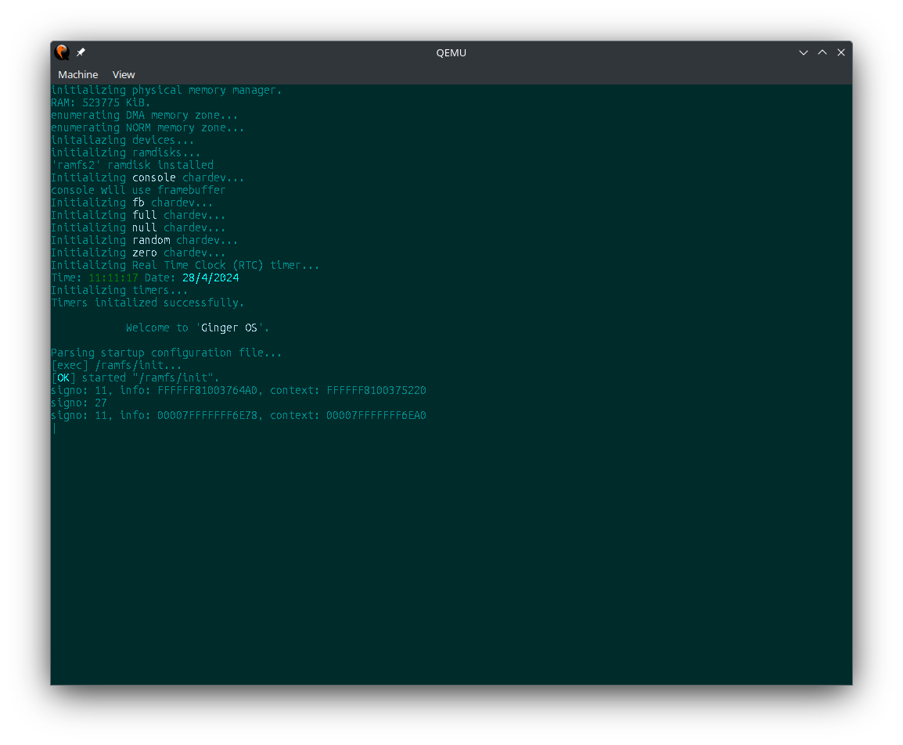

# gingerOs-x86_64

 
 

Ginger Operating System (Ginger OS) is a simple OS intended to be fully POSIX-compliant and to some extent, though not fully, Linux compatible as much as possible.

Development of ginger Os started late in 2020 as a simple project for learning purposes and somewhere along the lines I found so much zeal and interest in OS-Dev and decided to go full blown and actually dedicate my time and resources into building something of my own. As of 2022, Ginger OS was still no where near being usable but the amount of knowledge I had gained along the way propelled me to my first ever useful, though small, intel x86 OS with a minimal shell and some basic programs like (with credit to UC's xv6 project), sh, cat, echo, grep, wc, pwd, etc. that you can find at the repo [gingerOS](http://github.com/Emment-Yamikani/gingerOs.git).

## Screenshots

### qemu screenshots

### vbox screenshots

## Supported Architectures

- AMD/Intel
  - x86
  - x86_64
- Riscv (Not supported yet)

Current working on making intel x86_64 arch to work perfectly, then move on to other archs and then later their 32 bit counterparts.

## Features

Please see next section [Road Map](roadmap.md) for more info.

## Road Map

Please read the [Road Map](roadmap.md) to know more about the current and future progress of the Operating System.

## Build requirements
  - GNU's gcc cross compiler specifically version 10.2.1.
  - GNU's make version 4.4.1 or later.
  - Must have mtools, binutils version 2.36.1 or later.
  - Xorriso must have already been installed (needed to build a grub bootable image).
  - Qemu

## How to build

> make

## How to run with Qemu

> make run

# Resources

  [OsDev wiki](https://wiki.osdev.org).

  [Guilds](https://tldp.org/guides.html).

  